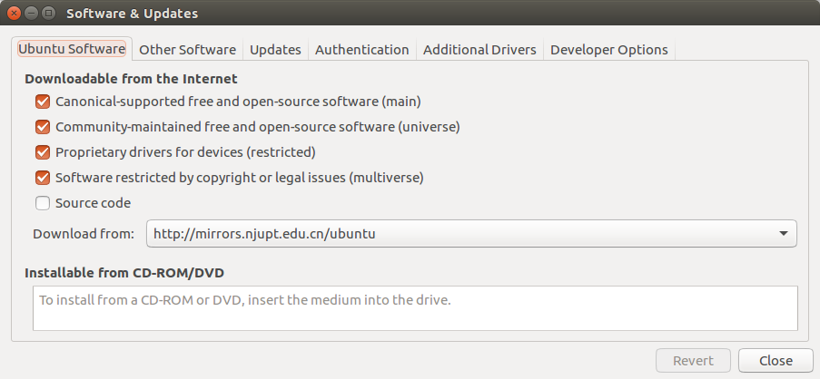
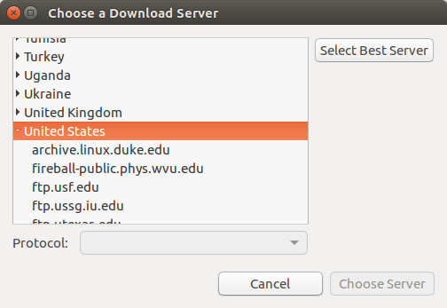

报错：
```bash
ERROR: cannot download default sources list from:
https://raw.githubusercontent.com/ros/rosdistro/master/rosdep/sources.list.d/20-default.list
Website may be down.
```
解决方法：
花了一天时间知道了是网络的问题



download from选择other server



点击select best server
多试几次，就可以安装成功啦！！！
